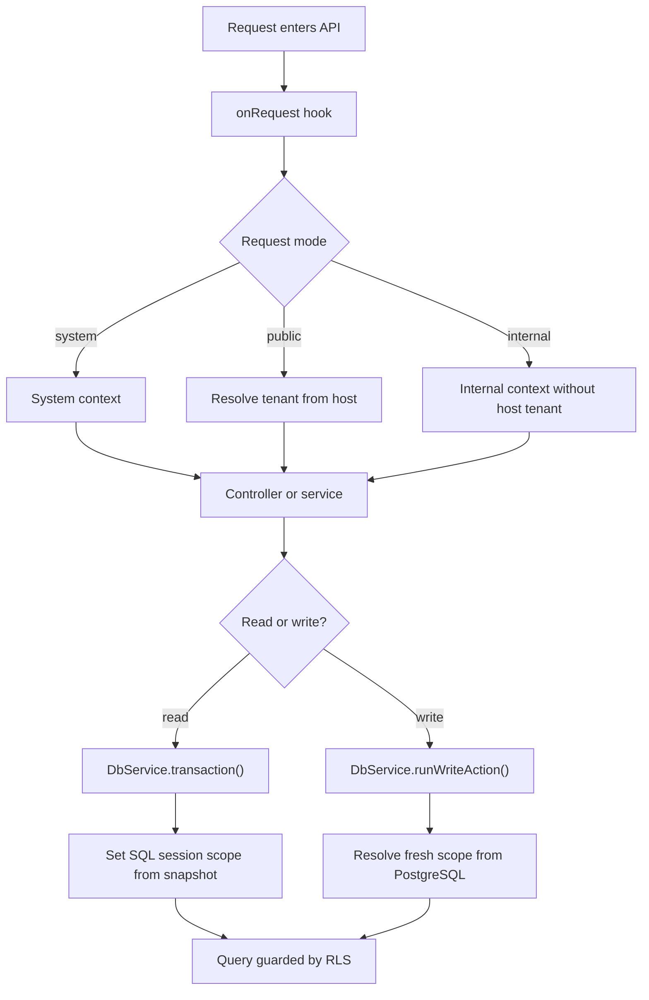

# How It Works

## One-paragraph view

Today this project has 4 conceptual levels: `platform`, `tenant`, `partner`, and a prepared place for `customer`. `Platform` is the whole product you own. `Tenant` is one rental business using the system. `Partner` is a supplier working inside one tenant. `Customer` is reserved for the future renter panel, but today it exists only as an actor shape in the core.

## What the core already does

- separates `web`, `api`, and `worker`
- keeps the backend as the only source of truth
- separates requests into `system`, `public`, and `internal`
- resolves public tenant context from host subdomain
- keeps access isolation in PostgreSQL RLS
- distinguishes `platform`, `tenant`, and `partner` as fixed internal profiles
- keeps `customer` outside internal memberships
- separates read path from write path

## Core flow in plain language

1. A request enters the API.
2. The runtime assigns a request ID and decides which mode the request is in.
3. If the request is public, the backend tries to resolve the tenant from the host.
4. If the request is internal, the backend does not trust host-based tenant scope.
5. Read operations may use the current request snapshot.
6. Write operations must resolve fresh actor scope directly from PostgreSQL before they run.
7. RLS remains the last line of defense on the tables themselves.

## Read path vs write path

### Read path

`DbService.transaction()` uses the actor snapshot already stored in request context.

Use it when:

- the operation is a read
- the current request snapshot is enough
- the code does not need a fresh permission proof from the database

### Write path

`DbService.runWriteAction()` does not trust the request snapshot. It asks PostgreSQL again whether the user is still active and still has the right role in the requested tenant or partner scope.

Use it when:

- the operation writes data
- the write must depend on fresh tenant or partner scope
- the system must not trust stale auth state

## What RLS protects

RLS is the real wall between tenants and partners.

In practice that means:

- `platform` may see and manage everything
- `tenant` may work only inside its own tenant
- `partner` may work only inside its own partner scope
- public requests do not automatically get table access just because tenant resolution worked

Important current rule:

- partner creation is platform-only by default
- partner-scoped memberships are also platform-only by default
- tenant-level partner management is reserved for a future explicit backend switch

## Customer status today

The core already knows the actor kind `customer`, but customer business features are not built yet.

What exists:

- `customer` actor type in shared contracts
- SQL session support for `app.actor_kind` and `app.customer_id`

What does not exist yet:

- customer tables
- login code flow
- customer sessions
- booking access rules
- customer endpoints

## What is intentionally still missing

This is still foundation work. The project does not yet include:

- bookings
- payments
- customer panel features
- public listing RLS
- public read models for catalog data
- tenant or partner CRUD endpoints
- real BullMQ business queues

## Where the details moved

`how-it-works` is now the short overview. Detailed technical reference lives in separate files:

- [Runtime Reference](./runtime-reference.md)
- [Database Reference](./database-reference.md)
- [Operations Reference](./operations-reference.md)

## One practical example

Example: a partner wants to change data inside its own scope.

1. Feature code calls `runWriteAction({ userId, targetTenantId, targetPartnerId }, run)`.
2. PostgreSQL checks whether the user is active and has an active partner membership for that exact tenant and partner.
3. If the check fails, the operation stops with `403`.
4. If the check passes, SQL session variables are set for that exact scope.
5. The business callback runs.
6. RLS still limits visible rows to the allowed tenant and partner scope.

That is the heart of the current core:

- request context helps reads
- fresh database scope protects writes
- RLS protects the data itself

This document is intentionally short. If code changes, update this overview together with the reference files.
