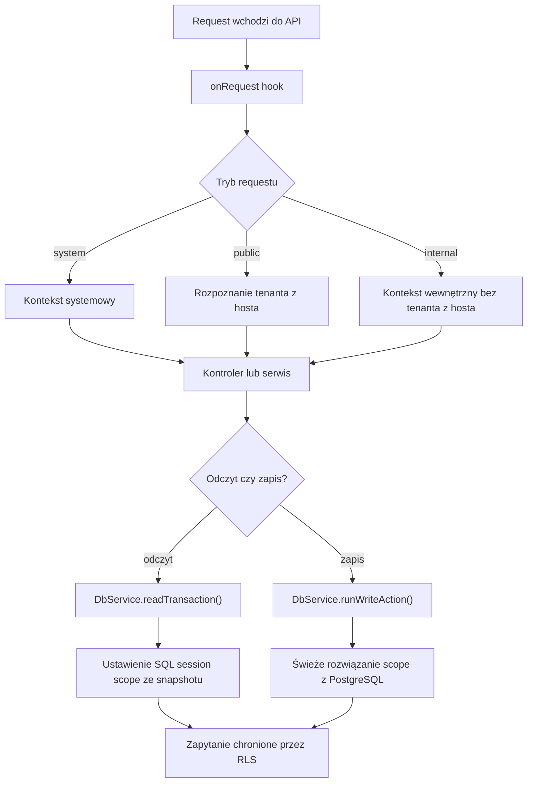

# Jak To Działa

## Widok w jednym akapicie

Ten projekt ma dziś 4 poziomy pojęciowe: `platform`, `tenant`, `partner` i przygotowane miejsce na `customer`. `Platform` to cały produkt, który posiadasz. `Tenant` to jedna wypożyczalnia korzystająca z systemu. `Partner` to dostawca działający wewnątrz jednego tenanta. `Customer` jest zarezerwowany pod przyszły panel klienta, ale dziś istnieje tylko jako kształt aktora w core.

## Co core już dziś robi

- rozdziela `web`, `api` i `worker`
- utrzymuje backend jako jedyne źródło prawdy
- rozdziela requesty na `system`, `public` i `internal`
- rozpoznaje publiczny kontekst tenanta po subdomenie hosta
- trzyma izolację dostępu w PostgreSQL RLS
- rozróżnia `platform`, `tenant` i `partner` jako stałe profile wewnętrzne
- trzyma `customer` poza wewnętrznymi membershipami
- rozdziela read path od write path

## Przepływ core najprościej

1. Request wchodzi do API.
2. Runtime nadaje mu request ID i rozpoznaje tryb requestu.
3. Jeśli request jest publiczny, backend próbuje rozpoznać tenanta z hosta.
4. Jeśli request jest wewnętrzny, backend nie ufa tenant scope z hosta.
5. Odczyty mogą używać bieżącego snapshotu requestu.
6. Zapisy muszą przed wykonaniem odpytać PostgreSQL o świeży scope aktora.
7. RLS pozostaje ostatnią linią obrony dla tabel.

## Read path i write path

### Read path

`DbService.readTransaction()` używa snapshotu aktora, który już siedzi w request context.

Ta ścieżka otwiera też transakcję PostgreSQL tylko do odczytu, więc nie może po cichu zamienić się później w ścieżkę zapisu.

Używamy go wtedy, gdy:

- operacja jest odczytem
- wystarcza bieżący snapshot requestu
- nie potrzebujemy świeżego dowodu uprawnień z bazy

### Write path

`DbService.runWriteAction()` nie ufa snapshotowi requestu. Jeszcze raz pyta PostgreSQL, czy użytkownik nadal jest aktywny i nadal ma właściwą rolę w żądanym tenant albo partner scope.

Nie działa jak globalna kolejka zapisów dla całego tenanta. Dowodzi tylko stan aktora. Jeśli przyszła funkcja będzie potrzebowała prawdziwej serializacji dla jednego tenanta, jednego partnera albo konkretnego zasobu biznesowego, musi sama wziąć jawny lock wewnątrz transakcji zapisu.

Używamy go wtedy, gdy:

- operacja zapisuje dane
- zapis zależy od świeżego tenant lub partner scope
- system nie może ufać starym danym auth

## Co chroni RLS

RLS jest prawdziwą ścianą między tenantami i partnerami.

W praktyce oznacza to, że:

- `platform` może widzieć i zarządzać wszystkim
- `tenant` może działać tylko wewnątrz własnego tenanta
- `partner` może działać tylko wewnątrz własnego partner scope
- publiczny request nie dostaje automatycznie dostępu do tabel tylko dlatego, że tenant został rozpoznany

Ważna obecna zasada:

- tworzenie partnerów domyślnie jest tylko dla `platform`
- partnerowe membershipy też domyślnie są tylko dla `platform`
- tenant-level partner management jest zarezerwowany pod przyszły jawny przełącznik backendowy

## Status klienta dziś

Core zna już aktora `customer`, ale funkcje biznesowe klienta nie są jeszcze gotowe.

Co już istnieje:

- typ aktora `customer` we współdzielonych kontraktach
- wsparcie dla `app.actor_kind` i `app.customer_id` w sesji SQL

Czego jeszcze nie ma:

- tabel klientów
- logowania kodem
- sesji klienta
- reguł dostępu do bookingów
- endpointów klienta

## Czego świadomie jeszcze nie ma

To nadal jest warstwa fundamentu. Projekt nie zawiera jeszcze:

- bookingów
- płatności
- funkcji panelu klienta
- publicznego listingu RLS
- publicznych read modeli katalogu
- endpointów CRUD dla tenantów, partnerów, aut i lokalizacji
- realnych kolejek biznesowych BullMQ

## Gdzie przeniosły się szczegóły

`how-it-works` jest teraz krótkim overview. Szczegółowa referencja techniczna siedzi w osobnych plikach:

- [Referencja runtime](./runtime-reference.md)
- [Referencja bazy danych](./database-reference.md)
- [Referencja operacyjna](./operations-reference.md)

## Jeden praktyczny przykład

Przykład: partner chce zmienić dane we własnym scope.

1. Kod funkcji woła `runWriteAction({ userId, targetTenantId, targetPartnerId }, run)`.
2. PostgreSQL sprawdza, czy użytkownik jest aktywny i czy ma aktywny membership partnerowy dokładnie dla tego tenanta i partnera.
3. Jeśli sprawdzenie nie przejdzie, operacja kończy się `403`.
4. Jeśli przejdzie, ustawiane są zmienne sesyjne SQL dla tego dokładnego scope.
5. Uruchamia się callback biznesowy.
6. RLS nadal ogranicza widoczne rekordy tylko do dozwolonego tenant i partner scope.

To jest serce obecnego core:

- request context pomaga przy odczytach
- świeży scope z bazy chroni zapisy
- RLS chroni same dane

Ten dokument jest celowo krótki. Jeśli kod się zmieni, trzeba zaktualizować zarówno to overview, jak i pliki referencyjne.
